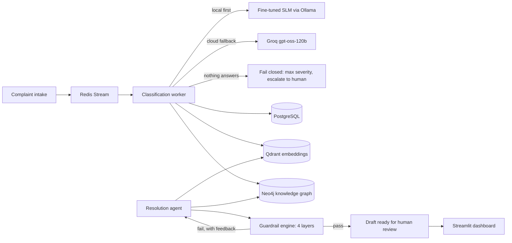

# ResolveAI — Intelligent Complaint Resolution Engine

> 🔗 **Live demo → https://resolveaideeason.streamlit.app/** — the full pipeline running on free, no-credit-card infrastructure ($0/mo), over a 30K slice of the corpus that fits the free storage tiers. First load may take ~30–60s while the free Space wakes from idle.

A full-stack system that triages real consumer financial complaints, drafts
regulation-aware responses with an agent, validates every draft through a
layered guardrail engine, and keeps a human reviewer in charge of the final
word. Built over **200,000 real complaints** from the CFPB's public consumer
complaint database.

The short version: complaints come in → a **fine-tuned 3B model** classifies
sentiment, intent and urgency → **vector search** finds precedent cases and a
**knowledge graph** supplies the regulations in play → an **agent** drafts a
response → **four guardrail layers** check structure, safety, regulatory
grounding and tone → a reviewer approves or rejects with feedback that feeds
regeneration. Every model call is metered into an LLMOps log you can browse
in the dashboard.

> **Just want to look around?** Open the [live demo](https://resolveaideeason.streamlit.app/) — or run the stack locally — and hit **Launch the demo** on
> the login screen — a read-only guided tour that walks every page and
> explains both the product and the architecture as you go (each page carries
> an "Under the hood" panel with the engineering decisions behind it).

---

## The pipeline



Design rules that hold everywhere:

- **PostgreSQL is the source of truth.** Qdrant and Neo4j are derived,
  best-effort side-channels; a Redis hiccup never loses a complaint because
  durable status fields let a sweep re-enqueue.
- **Fail closed, never silent.** If no model answers, complaints are flagged
  maximum-severity for human attention instead of guessing — and the
  deterministic-fallback path is visibly distinct from cloud-fallback in the
  telemetry.
- **The human owns the outcome.** Agents draft; reviewers approve. Rejection
  feedback is injected into the regeneration prompt.

## The dashboard

Six pages behind JWT auth (short-lived access token + rotating httpOnly
refresh cookie), plus a one-click read-only demo session for visitors:

| Page | What it does |
|---|---|
| **Dashboard** | Volume cards (anchored to the data's own clock, not wall-clock), sentiment donut with honest *unclassified* coverage, urgency × product heatmap, top companies |
| **Triage Queue** | Priority-sorted worklist over the full corpus — ordering, filtering, pagination all server-side |
| **Complaint Detail** | Narrative + classification, top-5 similar complaints via vector search (with how each was historically resolved), agent chain-of-thought, per-layer guardrail verdicts, approve / reject-with-feedback |
| **Analytics** | Weekly sentiment trend, product treemap, urgency histogram, company scorecard joining Postgres aggregates with Neo4j risk scores |
| **Graph Explorer** | Interactive vis.js canvas over the knowledge graph — search any company/product/issue/regulation, inspect nodes, re-center |
| **LLMOps Observatory** | Spend with cumulative overlay, local/cloud/fail-closed routing, p50/p95 latency per operation, classifier drift, guardrail violation log |

## The model

The classifier is **Qwen2.5-3B-Instruct fine-tuned with QLoRA** (4-bit NF4,
LoRA r=16 on all linear layers, class-weighted loss for the skewed label
distribution) on ~10K teacher labels, then exported to **GGUF Q4_K_M
(1.9 GB)** and served locally by Ollama — with Groq as the cloud fallback
when local inference is unavailable.

Held-out evaluation (995 examples):

| Metric | Score |
|---|---|
| Sentiment accuracy / macro-F1 | **0.90 / 0.84** |
| Intent accuracy / macro-F1 | **0.85 / 0.76** |
| Urgency MAE / Spearman | **0.223 / 0.845** |
| Valid structured JSON | **99.7%** |

The quantized deployment was re-verified through the real Ollama API
(100-sample check: 100% parseable, 89% sentiment accuracy, urgency MAE 0.25)
— quantization held. The full pipeline lives in `fine_tuning/`:
label engineering with a rubric-anchored teacher, audit tooling (length-leak
and template-collapse checks), training config, batched evaluation harness,
GGUF export, and an Ollama smoke test.

## Guardrails

Every draft passes four layers before a human ever sees it:

1. **Structural** — length, acknowledgment, concrete next steps
2. **Content safety** — forbidden promises/legal advice, PII auto-redaction
3. **Regulatory accuracy** — citations must be grounded in the regulations
   the graph actually returned (no invented statutes)
4. **Tone** — LLM-as-judge scoring empathy/professionalism/actionability,
   with deterministic thresholds and a fail-closed verdict if the judge is
   unreachable

Failures regenerate with the violations fed back as instructions, up to a
retry cap; unresolved drafts escalate to humans. Violations are stored
structured (layer, rule, message) and browsable in the Observatory.

## Stack

| Service | Role | Host port |
|---|---|---|
| FastAPI (async) | REST API, JWT auth, rate limiting | 8010 |
| PostgreSQL 16 | System of record | 5433 |
| Redis 7 | Streams (work queues) + token blocklist | 6380 |
| Qdrant | 200K × 384-dim narrative embeddings, cosine search | 6334 |
| Neo4j 5 + APOC | Company / product / issue / regulation graph | 7475 / 7688 |
| Ollama | Local inference for the fine-tuned GGUF | 11435 |
| Streamlit | Dashboard frontend | 8511 |

Everything runs in Docker Compose with health checks, named volumes,
non-root containers, and env-driven config (`.env`, never committed).

## Quick start

Prereqs: Docker Desktop (or engine + compose v2), ~6 GB free RAM for the stack.

```bash
git clone <repo-url> && cd Resolve_AI
cp .env.example .env        # set real passwords + JWT secrets (any long strings)
docker compose up -d        # 7 services; first build takes a few minutes
```

- Dashboard: <http://localhost:8511> — register an account, or click
  **Launch the demo**
- API docs (OpenAPI): <http://localhost:8010/docs>

The stack boots empty. To load the real corpus:

```bash
# 1. Download + normalize CFPB complaints (~200K rows, reservoir-sampled)
docker compose exec api python /scripts/download_cfpb_data.py \
  --output /fine_tuning/data/raw/cfpb_200k.csv \
  --workdir /fine_tuning/data/raw/_cfpb_workdir

# 2. Promote your account to admin (bulk import is admin-gated)
docker compose exec postgres psql -U resolveai -d resolveai_db \
  -c "UPDATE users SET role='admin' WHERE email='you@example.com';"

# 3. Bulk-import via the API (idempotent) — POST /api/v1/complaints/bulk-import
#    with {"path": "/fine_tuning/data/raw/cfpb_200k.csv"} (try it from /docs),
#    then embed the corpus into Qdrant:
docker compose exec api python /scripts/populate_vector_db.py

# 4. Seed the knowledge graph from the imported corpus
docker compose exec api python /graph_seed/seed_graph.py
```

To classify complaints you'll want either the fine-tuned GGUF loaded into
Ollama (see `fine_tuning/05_export_gguf.py` + `06_smoke_test.py`) or a
`GROQ_API_KEY` in `.env`; the workers start on demand:

```bash
docker compose exec -d api python -m app.workers.classification_worker
docker compose exec -d api python -m app.workers.resolution_worker
```

## Deploy

Putting this on a server with a public URL is a separate, self-contained setup:
a production Compose file that ships the built images, runs the stream workers
as services, keeps every datastore on the internal network, and puts **Caddy**
in front to terminate TLS with an auto-provisioned Let's Encrypt certificate —
only ports 80/443 are exposed.

```bash
cp .env.production.example .env.production   # set a domain + real secrets
docker compose -f docker-compose.prod.yml up -d --build
./scripts/seed_all.sh                        # migrations + corpus + graph
```

The full runbook — a DigitalOcean walkthrough (any Ubuntu VM works),
DNS/TLS, backups and troubleshooting — is in
[`docs/deployment.md`](docs/deployment.md). To run it for **$0** on free
managed tiers (Neon, Upstash, Qdrant Cloud, Aura, Hugging Face, Streamlit)
instead of a VM, see [`docs/deployment-free.md`](docs/deployment-free.md).

## Development

```bash
cd backend
python -m pytest tests/ -v          # 543 tests, SQLite + fakes, no services needed
python -m ruff check . ../frontend  # zero-warning policy, frontend included
python -m ruff format --check . ../frontend
pre-commit install                  # ruff + format on every commit
```

Tests mock external services at injection seams (the vector store, graph
store, LLM client and Redis are all constructor/dependency-injected), so the
suite runs in ~25 seconds with no containers.

Release history is in [`CHANGELOG.md`](CHANGELOG.md). Releases are cut from
`main`; a `v*` tag runs the full gate and ships to the hosted demo.

## Project layout

```
backend/
  app/
    api/routes/      # auth, complaints, analytics, graph, resolutions, llmops
    core/            # security, dependencies
    models/          # SQLModel ORM (complaints, users, resolutions, llm_logs)
    schemas/         # Pydantic wire contracts (never expose ORM rows)
    services/        # classifier, embedder, vector/graph stores, guardrails,
                     # llm client, agent/ (tools, prompts, orchestrator)
    workers/         # Redis Streams consumers (classification, resolution)
  alembic/           # migrations
  tests/             # 30 test files
frontend/            # Streamlit app: pages/, api_client, auth, tour,
                     # engineering_notes, theme
fine_tuning/         # label engineering → QLoRA training → eval → GGUF export
graph_seed/          # curated regulations + patterns, Neo4j seeding
scripts/             # CFPB download, embedding backfill
```

## Data

Complaint data comes from the
[CFPB Consumer Complaint Database](https://www.consumerfinance.gov/data-research/consumer-complaints/)
— public, real, and messy in all the instructive ways. Names and account
details in narratives arrive pre-redacted by the CFPB (`XXXX`); the guardrail
engine adds its own PII redaction on the way out.

## Roadmap

- Resolution-rate analytics, once enough reviewed resolutions accumulate to make
  the number meaningful
