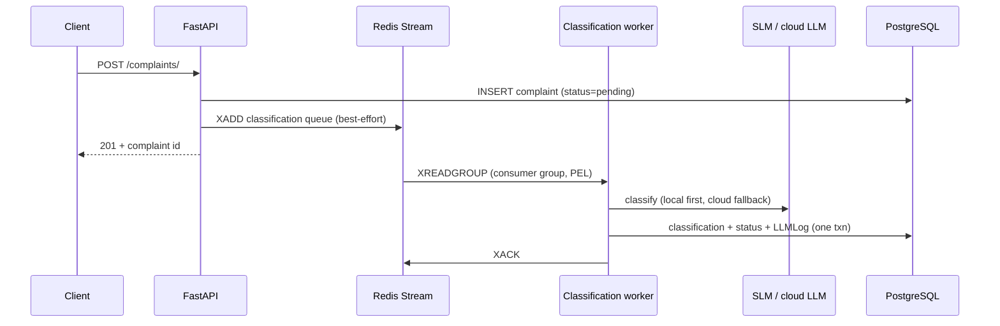

# Architecture

How ResolveAI is put together, and why it's put together that way. The
README has the elevator version; this is the engineering version.

## System topology

Seven services under Docker Compose:

| Service | Role | Why it's here |
|---|---|---|
| `api` (FastAPI, async) | REST API, auth, validation, rate-limit middleware | Single entry point; also hosts the workers as on-demand processes |
| `postgres` | System of record | Complaints, users, resolutions, labels, LLM telemetry |
| `redis` | Streams (work queues) + refresh-token blocklist | At-least-once delivery with consumer groups; cheap revocation set |
| `qdrant` | 200K × 384-dim narrative embeddings | Cosine similarity for precedent search |
| `neo4j` (+APOC) | Company/product/issue/regulation graph | Relationship queries SQL is bad at: risk profiles, regulation lookup, bounded neighborhoods |
| `ollama` | Local inference for the fine-tuned GGUF | Cost ≈ 0 classification when local hardware can carry it |
| `frontend` (Streamlit) | Reviewer dashboard | Server-side Python renders everything; the browser never talks to the API directly |

## The one rule that shapes everything: PostgreSQL is the truth

Every other store is **derived and best-effort**:

- Qdrant points and Neo4j nodes are written *after* the Postgres transaction
  commits. If those writes fail, the complaint is still consistent — a
  backfill can repair the side-channels from Postgres at any time.
- Redis Stream messages are *signals*, not state. A complaint's durable
  `status` field is what matters; if an enqueue is lost or a backlog is
  deleted, a sweep can re-enqueue everything `pending`/`escalated` from
  Postgres. Losing Redis loses no data, only promptness.

This is why the submit endpoint commits first and enqueues
best-effort-with-logging second, and why the workers treat "Qdrant down"
as a warning, not a failure.

## Async pipeline

- **Consumer groups** give at-least-once delivery: a crashed worker leaves
  its message in the pending-entries list for redelivery.
- **The classify call runs in a thread** (`asyncio.to_thread`) — the model
  client is synchronous, and blocking the event loop would stall every
  concurrent request in that process.
- **SIGTERM drains gracefully**: the worker finishes the in-flight message,
  ACKs, and exits.

The resolution worker follows the same shape with one extra subtlety: a
two-transaction choreography. It first flips the complaint to
`agent_triggered` in its own transaction (so the UI can show progress), then
writes the resolution + final status + N LLM log rows atomically.

## Classification routing and failure policy

1. **Local first** — the fine-tuned Qwen2.5-3B via Ollama (free, private).
2. **Cloud fallback** — Groq `openai/gpt-oss-120b` when local is unavailable
   or skipped (`LLM_SKIP_LOCAL`). The model is a config default, so a
   redeploy is how it moves when Groq retires one.
3. **Fail closed** — if nothing answers, a deterministic fallback labels the
   complaint `extreme_negative` / urgency 5 / `escalated`. When the system
   is blind it demands human eyes; it never guesses politely.

The telemetry keeps these stories distinct: fail-closed rows log as
`provider="none"`, while `was_fallback=true` marks cloud-covering-for-local.

## The resolution agent

A fixed pipeline, not a free-form loop — auditable and testable:

1. Gather context concurrently (`asyncio.gather` with
   `return_exceptions=True` — a dead tool degrades the draft, never kills
   the run): precedents from Qdrant, regulations and company history from
   Neo4j.
2. Draft with the LLM, citing what the tools actually returned.
3. Validate through the guardrail engine.
4. On failure, regenerate with the violations injected as instructions
   (bounded retries), then escalate to a human if still failing.

Human rejection re-enters the same loop: reviewer feedback is injected
exactly the way guardrail feedback is.

## Guardrails: four layers, fail closed

| Layer | Type | Checks |
|---|---|---|
| Structural | Pure function | Length bounds, acknowledgment present, concrete next steps |
| Content safety | Pure function | Forbidden promises/legal advice patterns; PII auto-redaction |
| Regulatory accuracy | Pure function | Every cited regulation must be grounded in what the graph returned — invented statutes are violations |
| Tone | LLM-as-judge | Empathy / professionalism / actionability scores with deterministic thresholds (every score ≥ 6) |

The judge is *gated behind* clean deterministic layers (no point scoring a
draft that's structurally broken) and is itself fail-closed: judge
unreachable → no verdict → escalate, because "couldn't check" must never
read as "passed". Violations persist as structured rows (layer, code,
message) — filterable in the dashboard, usable as regeneration feedback.

## Auth

- Short-lived **JWT access token** (HS256) in the `Authorization` header.
- **Rotating refresh token in an httpOnly cookie** — the frontend never
  reads it; the browser (or the dashboard's per-session HTTP client cookie
  jar) carries it. Logout adds the refresh token to a Redis blocklist.
- The Streamlit dashboard holds the access token in session state and
  silently refresh-retries on 401.

## API conventions

- **Schemas ≠ models**: Pydantic wire contracts in `schemas/`, SQLModel ORM
  rows in `models/`; ORM objects never serialize to the wire.
- **Lean row shapes per view**: the triage queue ships 200-char previews,
  not 20K-char narratives; the detail view fetches the full row by id.
- **Aggregate in the database**: analytics endpoints return `GROUP BY`
  results (O(groups)), never pages of raw rows to count client-side.
- **Dialect seams made explicit**: tests run SQLite, production runs
  Postgres. The two disagreements that can't be papered over — NULL
  placement under `DESC` ordering and day-truncation SQL — are handled
  explicitly (`NULLS LAST`, a per-dialect day-bucket helper).
- **Declaration order matters**: static routes (`/queue`) are declared
  before path-param routes (`/{id}`).

## Observability

Every model call writes one `llm_logs` row — operation, provider, model,
tokens, latency, cost, fallback flag — in the same transaction as the work
it measures. The LLMOps endpoints (`/llmops/*`) are SELECTs over that table;
the Observatory page renders them. Telemetry that's written with the work
can't drift from it.

## Testing strategy

506 tests across 27 files, running in ~20s with **no services**: SQLite
(via `aiosqlite`) plus injected fakes at the same seams production uses —
the vector store, graph store, LLM client and Redis are all
constructor/dependency-injected. External providers are never called in
tests. The frontend shell is validated with Streamlit's `AppTest` harness
(real script-run context, pre-seeded session state).

What SQLite can't catch (native-enum casts, NULL ordering) is exactly what
the explicit dialect seams above exist for — found live, pinned in code,
documented here so it stays found.
